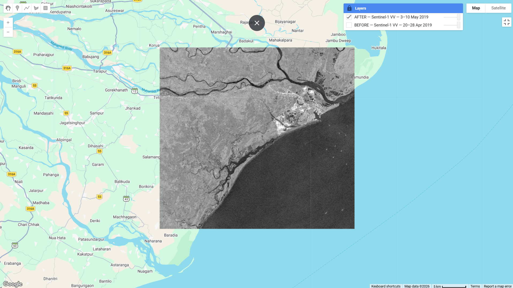

# Eyewall

Eyewall is a local prototype for human-reviewed cyclone-coast preparation in the Kendrapara–Paradip delta, Odisha.

## What is real and what is illustrative

| Capability | Status |
|---|---|
| Elevation, mapped assets, historical cyclone tracks | Processed local SRTM, OpenStreetMap and NOAA IBTrACS files |
| Flood layer and asset exposure | Sea-connected bathtub screening scenario; not a hydrodynamic model |
| Browser exposure and server exposure API | Both compute screening exposure from the shared grid, elevation, and assets; server reference cases are covered, with no cross-runtime parity test |
| Forecast context | Open-Meteo public forecast feed; unavailable offline and not observations |
| Gemini drafting | Implemented server-side with a number guardrail and template fallback; unavailable when no usable key is configured |
| Earth Engine / Sentinel-1 retrieval | Unavailable; gee_service has no operational integration |
| Human review and audit | Local SQLite queue; hash-chained audit export; no message dispatch |

This prototype is not an official forecast, evacuation directive, hydrodynamic simulation, or verified damage/outage model. OSM facility completeness and shelter capacity are not verified. Use official IMD/OSDMA guidance and local expertise.

## Quickstart

Python 3.11+ is recommended. On Windows, use the Python launcher (py), since python3 may not be installed and python can resolve to the Microsoft Store stub.

    py -m venv .venv
    .venv\Scripts\activate
    py -m pip install -r requirements.txt
    py -m uvicorn server.main:app --reload --port 8000

Open http://127.0.0.1:8000. The application starts with no API keys; Google features report unavailable and the draft path uses a local template. Create .env from .env.example only when configuring server-side credentials. Keys must never go into browser code.

### Static demo

The original static page is still available without Python dependencies:

    py -m http.server 8000

Open http://127.0.0.1:8000. The static page needs an internet connection for Leaflet map assets and map tiles. Open-Meteo, review, and API functions require FastAPI.

## Architecture

    Browser (vanilla JS) ── local exposure/map ── processed data/
           │ same-origin API
           ▼
    FastAPI ── screening exposure endpoint
           ├── template advisory + SQLite review/audit
           └── Google integrations: unavailable in this revision

The browser has no Gemini key field or direct Gemini request. FastAPI serves static/ and the read-only processed data/ directory. The review decision path writes only local SQLite records.

### API reference

- GET /api/health — feature availability; Google services report unavailable.
- GET /api/exposure?surge=3 — server-side screening calculation for surge in 0–8 m.
- GET /api/weather — same-origin Open-Meteo forecast proxy; returns an unavailable status offline.
- POST /api/advisory/draft — template-only SSE draft; limited to 10 requests/minute per IP.
- GET /api/review/queue, POST /api/review/{draftId}/decision — local human-review queue.
- GET /api/audit/export — audit entries and hash-chain verification.
- GET /api/sar/evidence, POST /api/sar/refresh — empty evidence response; refresh returns 409 until GEE is implemented.

## Google services

No Google product integration is active in this revision. Gemini and Earth Engine must not be described as live. Credential setup notes in docs/SETUP_GOOGLE.md explain the intended server-side boundary and the current implementation gap.

## Limitations and data sources

The bathtub model floods low cells connected to sea-level seeds using four-neighbour connectivity. It is a screening scenario, not a surge forecast or hydrodynamic simulation. The OSM extract can omit or misclassify facilities, and schools/community facilities are shelter-capacity proxies only. Historical IBTrACS tracks are retrospective records. See DATA_SOURCES.md for sources, licenses, and processing notes.

No SAR reference masks or ground-truth flood observations are available in this repository, so validation skill scores have not been computed. See validation/REPORT.md.

## Development

    py -m pytest -q
    py -m ruff check .

For the current test matrix, see TESTING.md. The standard-library preprocessing workflow remains py prep.py and expects the three local raw inputs documented in DATA_SOURCES.md.

## License

MIT. See LICENSE.
